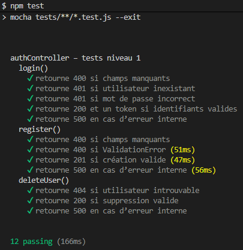
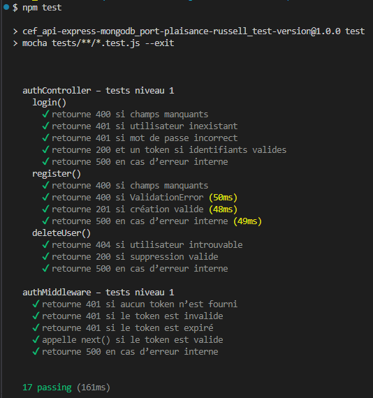

# Tests de niveau‑1 : Tests unitaires

Les tests unitaires valident la logique métier de manière isolée.  
Ils ne dépendent d’aucune base de données ni d’aucun service externe.

## Objectifs

- Vérifier les comportements métier  
- Tester les branches conditionnelles  
- Garantir la robustesse des contrôleurs et middlewares  
- Empêcher les régressions lors des évolutions

## Outils

- **Mocha** : moteur de tests  
- **Chai** : assertions  
- **Sinon** : stubs, spies, mocks

## Principes

- Chaque dépendance externe est stubée :  
  - `User.findOne`, `User.create`, `User.findByIdAndDelete`  
  - `user.comparePassword`  
  - `jwt.sign`
- Centralisation dans le fichier `tests.mock.js` des fonctions communes aux tests unitaires :
  - `mockResponse()` : simule la réponse Express `res.status().json()`
  - `mockNext()` : spy pour les middlewares
- Centralisation des stubs JWT dans `jwt.mock.js` :
  - `mockJwtVerify()` : simule un token valide
  - `mockJwtVerifyError()` : simule les erreurs JWT (invalide, expiré…)
  - `mockJwtSign()` : simule la génération d’un token
- Aucun accès à MongoDB  
- Chaque test est isolé via `afterEach(() => sinon.restore())`

## Exemples

### Issue‑15 : tests unitaires du contrôleur `authController.js`

**Résultats des tests (issue-15) :**

---

### Issue‑16 : tests unitaires du middleware `authMiddleware.js`

**Résultats des tests (issue-15 : non-regression) et (issue 16 : consommation):**

---
