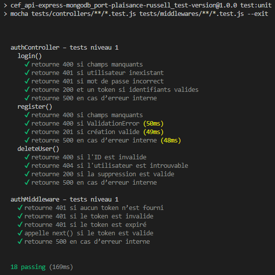

# Tests de niveau‑1 : Tests unitaires

Les tests unitaires valident la logique métier de manière isolée.  
Ils ne dépendent d’aucune base de données ni d’aucun service externe.

## Objectifs

- Vérifier les comportements métier  
- Tester les branches conditionnelles  
- Garantir la robustesse des contrôleurs et middlewares  
- Empêcher les régressions lors des évolutions

## Outils

- **Mocha** : moteur de tests  
- **Chai** : assertions  
- **Sinon** : stubs, spies, mocks

## Principes

- Chaque dépendance externe est stubée :  
  - `User.findOne`, `User.create`, `User.findByIdAndDelete`  
  - `user.comparePassword`  
  - `jwt.sign`
- Centralisation dans le fichier `tests.mock.js` des fonctions communes aux tests unitaires :
  - `mockResponse()` : simule la réponse Express `res.status().json()`
  - `mockNext()` : spy pour les middlewares
  - `afterEachRestore()` : restaure automatiquement les stubs/spies Sinon après chaque test
- Centralisation des stubs JWT dans `jwt.mock.js` :
  - `mockJwtVerify()` : simule un token valide
  - `mockJwtVerifyError()` : simule les erreurs JWT (invalide, expiré…)
  - `mockJwtSign()` : simule la génération d’un token
- Aucun accès à MongoDB  
- Chaque test est isolé via `afterEach(() => sinon.restore())`

- Les tests unitaires du contrôleur `authController` ont été mis à jour suite à l’issue‑17 :
  - utilisation d’`ObjectId` valides pour tester `deleteUser`
  - gestion du cas `ID invalide → 400`
  - gestion du cas `email déjà utilisé → 400`
  - simulation d’erreurs internes via `mockDeleteError()`
- Les stubs sont restaurés automatiquement via `afterEachRestore()`, sauf pour les stubs créés dans les helpers qui nécessitent un `restore()` explicite.

## Exemples

### Issue‑15 : tests unitaires du contrôleur `authController.js`

**Résultats des tests (issue-15) :**

---

### Issue‑16 : tests unitaires du middleware `authMiddleware.js`

**Résultats des tests (issue 15 : non-regression) et (issue 16 : consommation):**

---

### Issue‑17 : mise à jour des tests unitaires du contrôleur `authController.js`

Les tests unitaires ont été adaptés pour refléter les évolutions du contrôleur :

- ajout du contrôle `mongoose.Types.ObjectId.isValid()`  
- gestion de l’erreur MongoDB `E11000`  
- mise à jour des tests de `deleteUser` :
  - 400 si ID invalide  
  - 404 si utilisateur introuvable  
  - 200 si suppression valide  
  - 500 en cas d’erreur interne  

Ces tests garantissent la cohérence entre la logique métier et les tests d’intégration.

**Résultats des tests (issues 15 et 16 : non-regression) et (issue 17 : intégration):**

---
