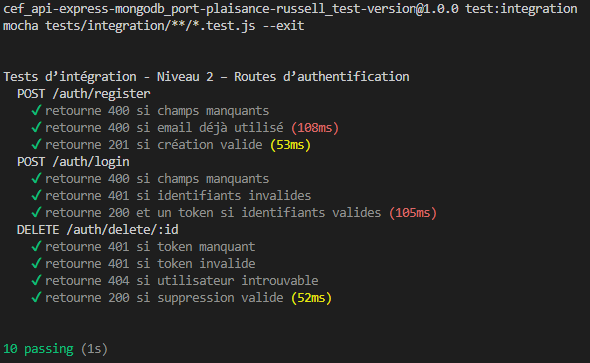
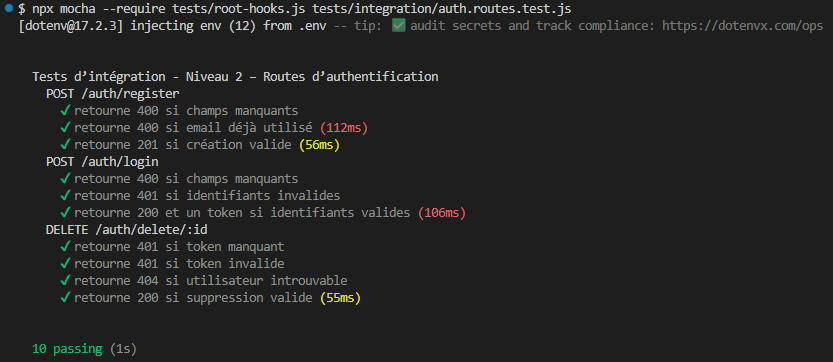
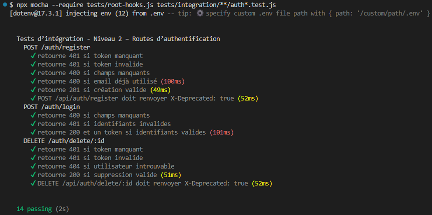

# Tests Authentification de niveau‑2 : Tests d’intégration

Les tests d’intégration valident le fonctionnement complet des routes Express, en interaction avec Mongoose.

## 1. Objectifs

- Vérifier le comportement réel des routes  
- Tester la logique Express + Mongoose  
- Valider les middlewares JWT en conditions réelles  
- Détecter les erreurs de câblage ou de configuration

## 2. Outils

- **Supertest** : requêtes HTTP simulées  
- **MongoMemoryServer** : base MongoDB en mémoire
- **Mocha / Chai** : assertions

---

## 3. Principes

- Le serveur Express est lancé dans un environnement de test  
- Une base MongoDB temporaire est créée en mémoire  
- Les modèles Mongoose sont réellement utilisés  
- Les contrôleurs et middlewares sont testés en conditions réelles

- Le secret JWT est défini dans les tests via `process.env.JWT_SECRET = 'testsecret'`.
- Les tests utilisent désormais des `ObjectId` valides pour éviter les CastError Mongoose.

---

## 4.Scénarios testés

### 4.1 `POST /auth/register` (route protégée + dépréciée)

- 400 si champs manquants  
- 400 si email déjà utilisé (erreur MongoDB `E11000`)  
- 201 si création valide
- 401 en v0.2.1-dev (route désormais privatisée + dépréciée)
- Vérification du header X-Deprecated: true

### 4.2 `POST /auth/login`

- 400 si champs manquants  
- 401 si identifiants invalides  
- 200 + token si identifiants valides  

### 4.3 `DELETE /auth/delete/:id` (route protégée + dépréciée)

- 401 si token manquant  
- 401 si token invalide  
- 404 si utilisateur introuvable (ObjectId valide mais non trouvé)  
- 200 si suppression valide  
- Vérification du header X-Deprecated: true

---

## 5. Exemples

### 5.1 Issue 17 : tests du middleware JWT et des routes protégées

**Résultats des tests :**

---

### 5.2 Issue 37 : tests de non-régression

**Résultats des tests :** (version v0.2.0-dev)

**Résultats des tests :** (version v0.2.1-dev)

---
