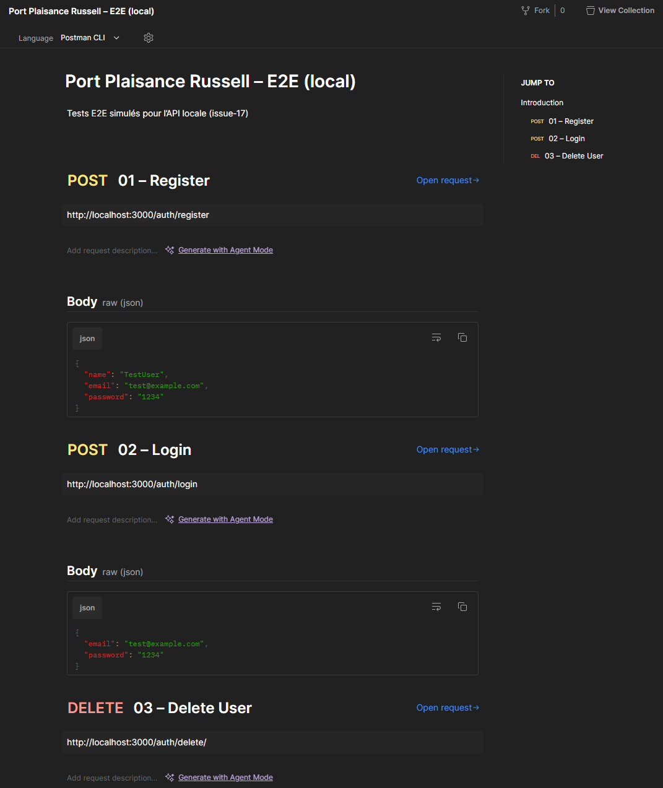
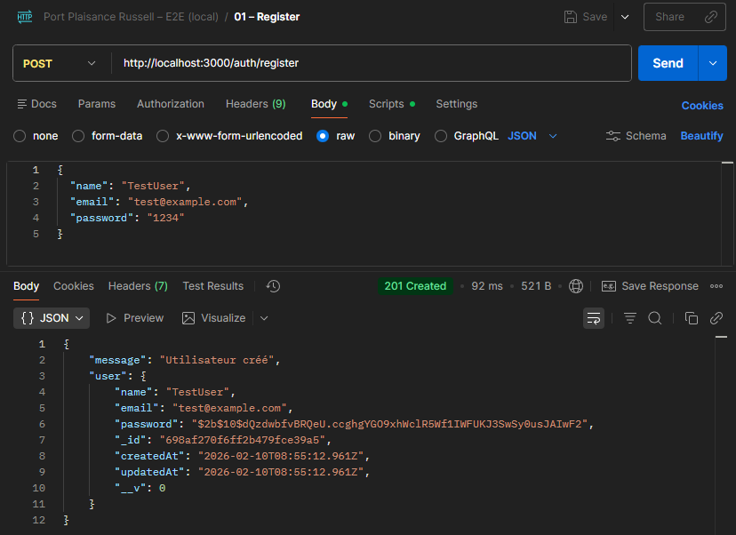
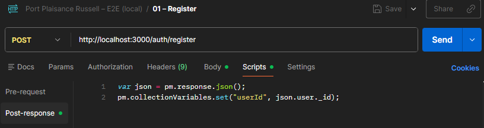
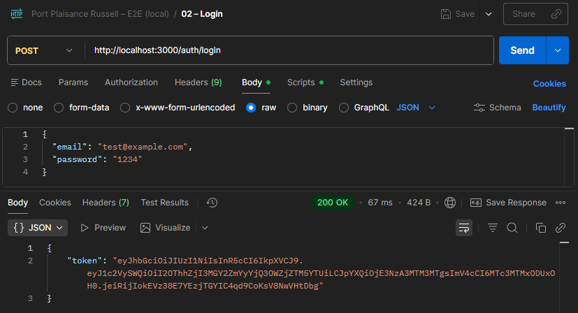
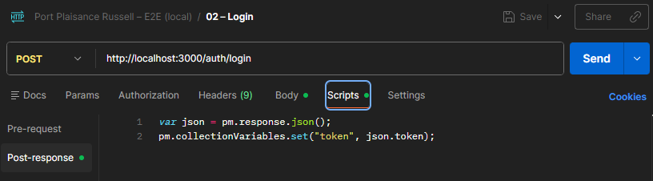
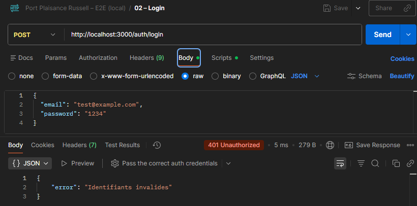

# Tests Authentification de niveau‑3 : Tests E2E

Les tests E2E valident l’API complète dans un environnement simulé ou réel.

Les tests E2E simulés constituent la première étape.  
Les tests E2E réels seront réalisés dans l’issue‑22, une fois la base MongoDB Atlas et le déploiement Alwaysdata en place.

---

## 1. Objectifs

- Vérifier le comportement global de l’API  
- Tester les scénarios complets utilisateur  
- Valider la cohérence entre les différentes couches
- Préparer les déploiements de versions intermédiaires
- Préparer la livraison finale

---

## 2. Principes

Les tests E2E sont réalisés en deux étapes :

### 2.1 Tests E2E simulés (issue‑17)

- API locale
- Base MongoMemoryServer
- Postman
- Cycle complet : register → login → delete
- Objectif : valider l’API sans mocks ni stubs

### 2.2 Tests E2E réels (issue‑22)

- API déployée (Alwaysdata)
- Base MongoDB Atlas
- Postman (collection [collection-e2e-local.json](../assets/collection-e2e-local.json))
- Objectif : valider l’API en conditions de production

### 2.3 Test E2E simulé par collection Postman (issue-37)

- API locale
- Base MongoDB Atlas
- Postman :
  - collection [API-Port-Russell_v0.2.0-dev_01-PreDeploy.json](../assets/API-Port-Russell_v0.2.0-dev_01-PreDeploy.json)
  - collection [API-Port-Russell_v0.2.1-dev_01-PreDeploy.json](../assets/API-Port-Russell_v0.2.1-dev_01-PreDeploy.json)
- Objectif : préparer les vérifications de pré-déploiement

---

## 3. Outils

Environnement simulé :

- API locale
- Base MongoMemoryServer
- Serveur express local
- Postman

Environnement réal :

- API déployée (Alwaysdata) ou locale
- Base MongoDB réelle (Mongo Atlas)
- Serveur Express réel (Alwaysdata)
- Postman

---

## 4. Scénarios typiques

- Inscription utilisateur  
- Connexion utilisateur  
- Suppression utilisateur  
- Accès à une route protégée  
- Gestion des erreurs
- Vérification de la dépréciation (à partir de v0.2.1-dev)

---

## 4. Exemples et mises en oeuvre

Les tests E2E valident le fonctionnement complet de l’API **du point de vue d’un client externe**.  
Dans ce projet, deux approches coexistent :

1. **Tests E2E simulés (environnement local)** – réalisés dans l’issue‑17  
2. **Tests E2E réels (API déployée)** – réalisés dans l’issue‑22

### 4.1 Issue‑17 : validation initiale de l’API - Tests E2E simulés

#### 4.1.1 Objectifs des tests E2E simulés

- Valider le cycle complet d’un utilisateur en environnement local  
- Tester l’API sans mocks ni stubs  
- Vérifier la cohérence entre les tests unitaires (niveau‑1) et d’intégration (niveau‑2)  
- Préparer les tests E2E réels de l’issue‑22

---

#### 4.1.2 Environnement des tests E2E simulés

Les tests E2E simulés utilisent un serveur Express dédié (`tests/test-app.js`) qui :

- démarre une base MongoMemoryServer
- initialise l’application Express sans connexion MongoDB réelle
- expose l’API sur `http://localhost:3000`
- gère proprement l’arrêt (SIGINT, SIGTERM)

Ce serveur permet d’exécuter les scénarios Postman sans dépendre d’une base MongoDB réelle.

##### 4.1.2.1 Commandes disponibles

- `npm run test:app`  
  → lance test-app.js sans nodemon (recommandé pour les tests Postman)

- `npm run test:app:watch`  
  → lance test-app.js avec nodemon (développement uniquement)

> ⚠️ Attention :
>
> - Lors de l’utilisation de `npm run test:app:watch`, nodemon peut redémarrer automatiquement le serveur si des fichiers surveillés changent. Le fichier de configuration de Nodemon (`config/dev/nodemon.json`) permet d'éviter les redémarrages intempestifs.
> - Cela réinitialise la base MongoMemoryServer et peut provoquer des erreurs inattendues dues à une base vierge.  
> - Pour les tests Postman, utiliser `npm run test:app` est recommandé (car plus représentatif d'une version stabilisée).

##### 4.1.2.2 Collection Postman

La collection `docs-dev/tests/assets/collection-e2e-local.json` contient :

- Register → extraction automatique de `userId`
- Login → extraction automatique du `token`
- Delete User → suppression via `DELETE /auth/delete/:id`

---

#### 4.1.3 Scénarios testés (E2E simulés)

##### 4.1.3.1  `POST /auth/register`

- 400 si champs manquants  
- 201 si création valide  
- 400 si email déjà utilisé  

##### 4.1.3.2 `POST /auth/login`

- 400 si champs manquants  
- 401 si identifiants invalides  
- 200 + token si identifiants valides  

##### 4.1.3.3 `DELETE /auth/delete/:id`

- 401 si token manquant  
- 401 si token invalide  
- 404 si utilisateur introuvable  
- 200 si suppression valide  

---

#### 4.1.4 Scénario complet (local - simulé)

1. Inscription  
2. Connexion → récupération du token  
3. Suppression  
4. Vérification de la suppression  

#### 4.1.5 Résultats attendus (E2E simulé)

L'import dans Postman de la collection `docs-dev/tests/assets/collection-e2e-local.json` permet d'accéder à une JSDoc des différentes requêtes.

##### 4.1.5.1 Résultats de la requête `01 - Register`

La création d'un utilisateur rend les informations associées à l'enregistrement demandé.

Le script associé à cette requête permet un traitement de la réponse pour stocker dans une variable de la collection {userid} l'identifiant de l'utilisateur créé `user._id`.

Cet identifiant est réutilisé pour supprimer l'utilisateur par son identifiant (requête `03 - Delete User`).

##### 4.1.5.2 Résultat de la requête `02 - Login`

La connexion d'un utilisateur rend les informations associées au Token de l'utilisateur.

Le script associé à cette requête permet un traitement de la réponse pour stocker dans une variable de la collection {token} le jeton JWT.

Ce jeton JWT est réutilisé pour autoriser la suppression de l'utilisateur (requête `03 - Delete User`).

##### 4.1.5.3 Résultat de la requête `03 - Delete User`

La suppression d'un utilisateur nécessite l'autorisation (jeton JWT dans {token}) dans le Header et l'identifiant ({userId}) dans la route.

La réponse confirme la suppression de l'utilisateur référencé.

##### 4.1.5.4 Vérification de la suppression

En testant la connexion avec la requête de connexion (`02 - Login`), il est alors vérifiable que les informations de connexion ne sont plus valides pour cet utilisateur qui vient d'être supprimé.

La réponse avec le `statut 401` et le message d'erreur permet de confirmer la suppression de l'utilisateur.

---

### 4.2 Issue-37 : validation de l'API - Tests E2E simulés par collection Postman

(cette section doit préciser les tests de niveau 3 de l'authentification qui conduit à une faille de sécurité pour la version v0.2.0-dev, puis à une validation avec la v0.2.-dev et la séparation des routes et la gestion de l'obsolescence)

Les tests PreDeploy révèlent :

#### 4.2.1 Tests v0.2.0-dev

- **Faille de sécurité** : `/api/auth/register` accessible sans JWT  
- Refus de déploiement

#### 4.2.2 Tests v0.2.1-dev

- Séparation Auth/Users
- Routes Auth/register et Auth/delete :
  - **privatisées**
  - **dépréciées**
  - header `X-Deprecated: true`
- Collection PreDeploy mise à jour :
  - gestion automatique de la variable `deprecated`
  - scripts before/after
  - cohérence JWT

Ces tests constituent la validation finale avant la vérification de pré-déploiement de la version v0.2.1-dev.

---
