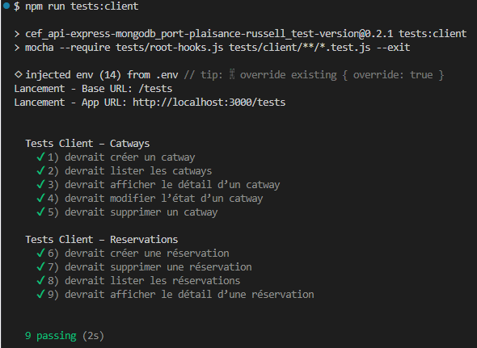
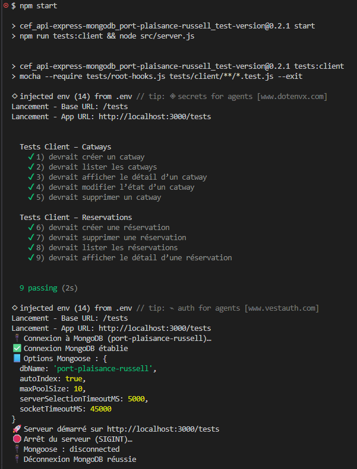

# 📄 Tests opérationnels Client — Phase 7

Validation des 9 fonctionnalités métier demandées par la capitainerie

Ce document décrit **techniquement** les tests opérationnels Client à implémenter.  
Ces tests sont distincts des tests développeurs et constituent la validation fonctionnelle attendue par le sujet du devoir.

Ils sont exécutés automatiquement **au lancement local de l’application** et affichent les résultats dans la console.

---

## 1. Objectif des tests Client

Les tests Client valident les **9 fonctionnalités métier** demandées par la capitainerie :

1. Créer un catway  
2. Lister tous les catways  
3. Récupérer les détails d’un catway  
4. Modifier la description d’un catway  
5. Supprimer un catway  
6. Prendre une réservation  
7. Supprimer une réservation  
8. Lister toutes les réservations  
9. Afficher les détails d’une réservation  

---

## 2. Organisation des fichiers

Les tests Client sont regroupés dans :

```txt
tests/client/
 ├── catways.client.test.js
 └── reservations.client.test.js
```

**Utilisation des outils internes :**

- `tests/root-hooks.js`  
  - charge `.env`  
  - démarre MongoMemoryServer  
  - connecte Mongoose  
  - nettoie la base avant chaque test  

- `tests/helpers/createTestUser.js`  
  - crée un utilisateur de test  
  - génère un token JWT valide  

Aucun autre fichier n’est nécessaire.

---

## 3. Préparation des données de test

Chaque test :

- utilise MongoMemoryServer (base isolée)  
- crée un utilisateur via `createTestUser()`  
- récupère un token JWT  
- utilise ce token pour les routes privatisées  
- crée les données nécessaires (catways, réservations)

---

## 4. Description technique des tests

### 4.1 Catways

#### Fonction 1 — Créer un catway

**POST /api/catways**  
→ statut **201**, retour `_id`

#### Fonction 2 — Lister les catways

**GET /api/catways**  
→ statut **200**, tableau

#### Fonction 3 — Détail d’un catway

**GET /api/catways/:id**  
→ statut **200**, champs corrects

#### Fonction 4 — Modifier un catway

**PATCH /api/catways/:id**  
→ statut **200**, champ mis à jour

#### Fonction 5 — Supprimer un catway

**DELETE /api/catways/:id**  
→ statut **204** (aucun contenu)

---

### 4.2 Reservations

#### Fonction 6 — Créer une réservation

**POST /api/catways/:id/reservations**  
→ statut **201**

#### Fonction 7 — Supprimer une réservation

**DELETE /api/catways/:id/reservations/:idReservation**  
→ statut **200**

#### Fonction 8 — Lister les réservations

**GET /api/catways/:id/reservations**  
→ statut **200**, tableau

#### Fonction 9 — Détail d’une réservation

**GET /api/catways/:id/reservations/:idReservation**  
→ statut **200**, champs corrects

---

## 5. Exécution automatique des tests Client

Les tests Client doivent s’exécuter automatiquement **au lancement local de l’application**, conformément au sujet du devoir.

Pour cela, aucun code n’est ajouté dans `server.js` afin d’éviter toute exécution en production (Alwaysdata).  
L’exécution automatique est gérée **exclusivement via les scripts npm**.

### 5.1 Script dédié aux tests Client

Dans `package.json` :

```json
"scripts": {
  "test:client": "mocha --require tests/root-hooks.js tests/client/**/*.test.js --exit"
}
```

### 5.2 Exécution automatique au lancement

Toujours dans `package.json` :

```json
"scripts": {
  "start": "npm run tests:client && node src/server.js",
  "dev": "npm run tests:client && nodemon src/server.js"
}
```

Ainsi :

- `npm start` → exécute les tests Client → lance l’application  
- `npm run dev` → exécute les tests Client → lance l’application en mode développement  

---

## 6. Résultats attendus

Lors du lancement local de l’application (`npm start` ou `npm run dev`) :

- Mocha exécute automatiquement les tests Client,  
- les résultats s’affichent dans la console,  
- les 9 tests doivent être **verts**,  
- aucune dépendance à Alwaysdata n’est utilisée,  
- l’application démarre ensuite normalement.

Exemple de sortie attendue :



---

## 7. Archivage

Aucun archivage n’est requis pour les tests Client.

Contrairement aux tests développeurs (niveau 4), les tests Client :

- ne font pas partie du pipeline PreDeploy,  
- ne nécessitent pas de dossier spécifique,  
- ne nécessitent pas de captures d’écran,  
- ne nécessitent pas de logs versionnés.

Ils constituent une **validation fonctionnelle locale**, destinée au client, et non un élément du pipeline de déploiement.

---

## 8. Conclusion

Ce document définit **techniquement et complètement** les tests opérationnels Client de la Phase 7.

L'image suivante montre le lancement des tests, puis du serveur, puis de l'arrêt (action `Ctrl+C` : SIGINT) du serveur.



Il sert de référence pour l’implémentation des tests dans `tests/client/` et garantit la conformité avec le sujet du projet.

---
