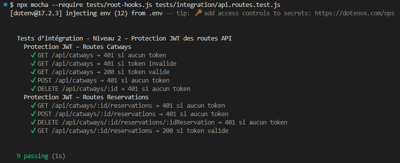
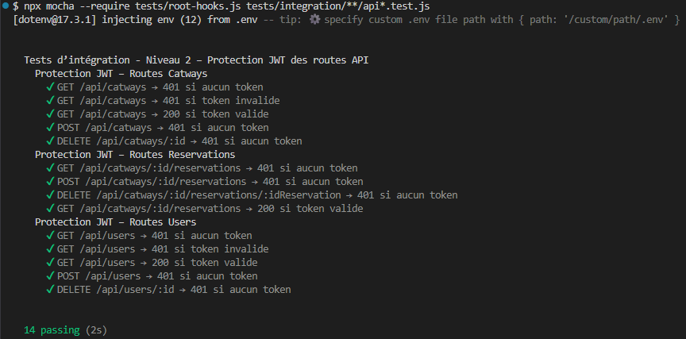

# Tests d’intégration — Niveau 2 — API (Protection JWT)

Ce document décrit les tests transversaux de protection JWT introduits dans l’issue‑37.

## 1. Objectifs

- Vérifier que les routes Users, Catways et Reservations sont correctement protégées.
- Garantir la non‑régression de la sécurité JWT.
- Tester la cohérence du secret JWT (jwtConfig.secret).
- Valider le pipeline complet Express + MongoMemoryServer.

---

## 2. Fichier de tests

`tests/integration/api.routes.test.js`

---

## 3. Scénarios testés

### 3.1 Routes Catways

- 401 si aucun token
- 401 si token invalide
- 200 si token valide

### 3.2 Routes Reservations

- 401 si aucun token
- 401 si token invalide
- 200 si token valide

### 3.3 Routes Users (à partir de la version v0.2.1-dev)

- 401 si aucun token
- 401 si token invalide
- 200 si token valide

---

## 4. Architecture technique

- MongoMemoryServer (root-hooks v0.2.0)
- createTestUser() pour générer un utilisateur + token JWT
- jwtConfig.secret pour garantir la cohérence de signature
- Supertest pour appeler Express

---

## 5. Rôle dans la stratégie globale

Ce fichier sert de garde‑barrière :  
il garantit que la sécurité JWT reste fonctionnelle après chaque évolution du projet.

Il complète les tests métier Catways et Reservations sans les dupliquer.

---

## 6. Résultats

### 6.1 issue-37 : privatisation des routes de l'API (Catways et Reservations, puis Users)

**Résultats des tests (issue-37) :** (version v0.2.0-dev)

**Résultats des tests (issue-37) :** (version v0.2.1-dev)

---
