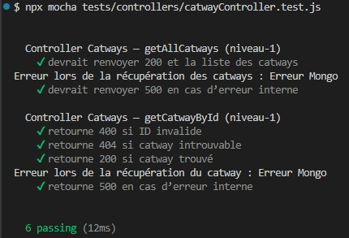
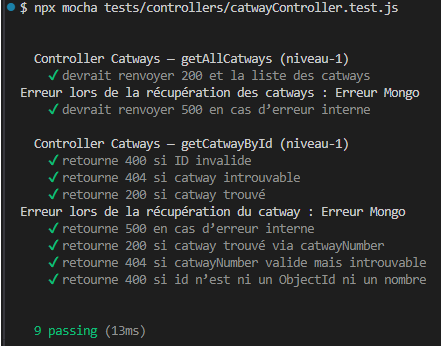

# Tests Catways de niveau‑1 : Tests unitaires

Les tests unitaires valident la logique métier du contrôleur Catways de manière isolée.  
Ils ne dépendent d’aucune base de données ni d’aucun service externe.

---

## 1. Objectifs

- Vérifier le comportement métier de `catwayController`
- Tester les branches conditionnelles
- Garantir la robustesse des contrôleurs avant l’intégration
- Empêcher les régressions lors des évolutions (issues 26 → 30)

---

## 2. Outils

- **Mocha** : moteur de tests  
- **Chai** : assertions  
- **Sinon** : stubs, spies, mocks

---

## 3. Principes

- Le modèle Mongoose `Catway` est entièrement stubé via `catway.mock.js`
- Les tests utilisent les helpers centralisés dans `tests.mock.js` :
  - `mockResponse()` : simule `res.status().json()`
  - `afterEachRestore()` : restaure automatiquement les stubs Sinon
- Aucun accès à MongoDB
- Chaque test est isolé

---

## 4. Scénarios testés

### 4.1 `getAllCatways()` (issue‑25)

- 200 + liste des catways si `Catway.find()` réussit  
- 500 si `Catway.find()` lance une erreur

---

### 4.2 `getCatwayById()` (issue‑26)

Cette issue‑26 introduit les tests unitaires de la route :

```txt
GET /catways/:id
```

#### 4.2.1 étape 1 - version initiale

La version initiale repose **exclusivement** sur l’identifiant interne MongoDB (`_id`).  

Cette version ne prend pas encore en charge l’identifiant métier `catwayNumber`.

##### 4.2.1.1 Scénarios testés

- **400** si l’identifiant n’est pas un ObjectId valide  
- **404** si aucun catway ne correspond à l’identifiant  
- **200** si un catway est trouvé  
- **500** si `Catway.findById()` lance une erreur interne  

##### 4.2.1.2 Mocks utilisés

- `mockFindById()`  
- `mockFindByIdError()`  

Ces stubs permettent d’isoler totalement la logique métier du contrôleur.

---

#### 4.2.2 Étape 2 — Logique hybride (_id + catwayNumber)

Cette étape introduit la prise en charge de l’identifiant métier `catwayNumber` dans la fonction :

```txt
GET /catways/:id
```

##### 4.2.2.1 Scénarios testés

- **200** si catway trouvé via `catwayNumber`  
- **404** si `catwayNumber` valide mais introuvable  
- **400** si `id` n’est ni un ObjectId ni un nombre  

##### 4.2.2.2 Notes

- Les tests du commit‑1 (ObjectId uniquement) restent valides  
- Les nouveaux tests utilisent `sinon.stub(Catway, 'findOne')`  
- Le contrôleur reste rétro‑compatible grâce à la priorité ObjectId

> Les tests hybrides utilisent `sinon.stub(Catway, 'findOne')` car la logique métier repose désormais sur `findOne` pour les identifiants métier.

---

## 5. Fichiers associés

- Tests : `tests/controllers/catwayController.test.js`
- Mocks : `tests/mocks/catway.mock.js`
- Contrôleur : `src/controllers/catwayController.js`

---

## 6. Résultats

### 6.1 issue-25 : liste des Catways

**Résultats des tests (issue-25) :**


### 6.2 issue-26 : détail d'un catway

**Résultats des tests (issue-26) - version initiale :**



**Résultats des tests (issue-26) - version hybride :**


