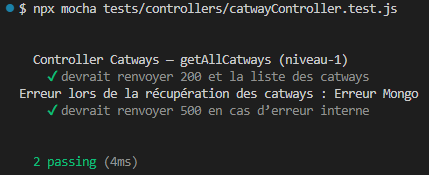

# Tests Catways de niveau‑1 : Tests unitaires

Les tests unitaires valident la logique métier du contrôleur Catways de manière isolée.  
Ils ne dépendent d’aucune base de données ni d’aucun service externe.

## 1. Objectifs

- Vérifier le comportement métier de `catwayController`
- Tester les branches conditionnelles
- Garantir la robustesse des contrôleurs avant l’intégration
- Empêcher les régressions lors des évolutions (issues 26 → 30)

## 2. Outils

- **Mocha** : moteur de tests  
- **Chai** : assertions  
- **Sinon** : stubs, spies, mocks

## 3. Principes

- Le modèle Mongoose `Catway` est entièrement stubé via `catway.mock.js`
- Les tests utilisent les helpers centralisés dans `tests.mock.js` :
  - `mockResponse()` : simule `res.status().json()`
  - `afterEachRestore()` : restaure automatiquement les stubs Sinon
- Aucun accès à MongoDB
- Chaque test est isolé

## 4. Scénarios testés

### 4.1 `getAllCatways()` (issue‑25)

- 200 + liste des catways si `Catway.find()` réussit  
- 500 si `Catway.find()` lance une erreur  

## 5. Fichiers associés

- Tests : `tests/controllers/catwayController.test.js`
- Mocks : `tests/mocks/catway.mock.js`
- Contrôleur : `src/controllers/catwayController.js`

## 6. Résultats

### 6.1 issue-25 : liste des Catways

**Résultats des tests (issue-25) :**

