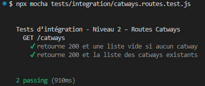
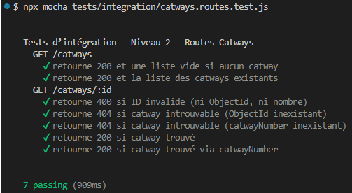
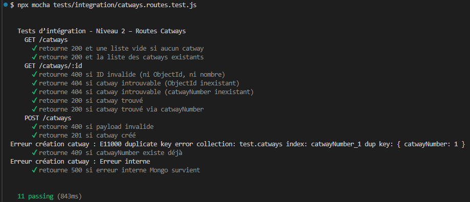
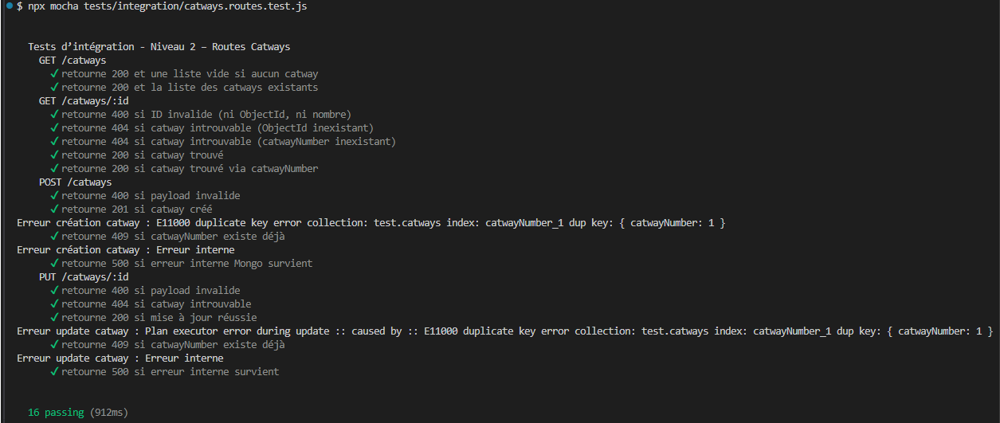
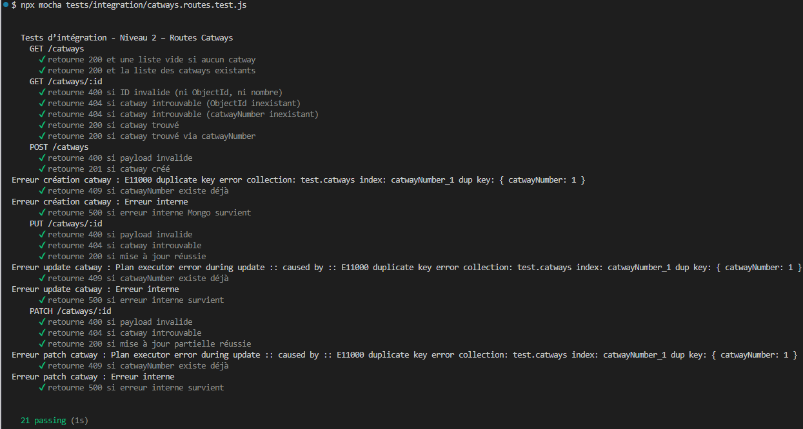
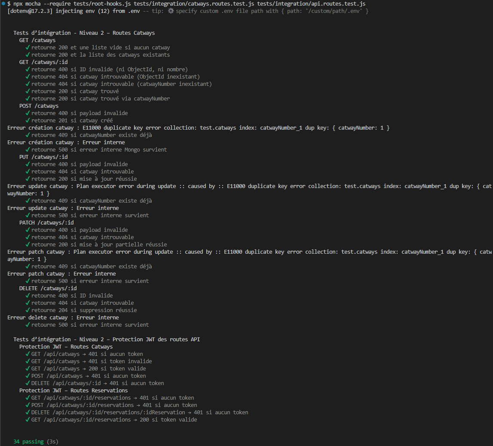

# Tests Catways de niveau‑2 : Tests d’intégration

Les tests d’intégration valident le fonctionnement réel des routes Catways, en interaction avec Express, Mongoose et MongoDB.

---

## 1. Objectifs

- Vérifier le comportement réel de la route `GET /catways`
- Tester l’intégration Express + Mongoose
- Détecter les erreurs de câblage ou de configuration
- Garantir la cohérence entre contrôleur, modèle et route

---

## 2. Outils

- **Supertest** : requêtes HTTP simulées  
- **MongoMemoryServer** : base MongoDB en mémoire  
- **Mocha / Chai** : assertions

---

## 3. Principes

- Le serveur Express (`src/app.js`) est utilisé tel quel
- Une base MongoDB temporaire est créée en mémoire
- Le modèle `Catway` est réellement utilisé
- Aucun mock → vrai test d’intégration
- Nettoyage de la base avant chaque test

---

## 4. Scénarios testés

### 4.1 `GET /catways` (issue‑25)

- 200 + tableau vide si aucun catway  
- 200 + liste des catways si des documents existent  
- Vérification des champs (`catwayNumber`, `type`, `catwayState`)  

---

### 4.2 `GET /catways/:id` (issue‑26)

Cette issue-26 introduit les tests d’intégration de la route :

```txt
GET /catways/:id
```

#### 4.2.1 étape 1 - version initiale

La version initiale utilise **uniquement** l’identifiant MongoDB (`_id`).  

Cette version ne prend pas encore en charge l’identifiant métier `catwayNumber`.

##### 4.2.1.1 Scénarios testés

- **400** si l’identifiant n’est pas un ObjectId valide  
- **404** si aucun catway ne correspond à l’identifiant  
- **200** si un catway valide est trouvé en base mémoire  
- Vérification du contenu retourné (`catwayNumber`, `type`, `catwayState`)  

##### 4.2.1.2 Principes

- utilisation réelle du modèle `Catway`  
- base MongoDB en mémoire via `MongoMemoryServer`  
- aucune logique hybride à ce stade  
- aucune validation métier via middleware (introduite en étape 3)  

---

#### 4.2.2 Étape 2 — Logique hybride (_id + catwayNumber)

Cette étape étend les tests d’intégration pour couvrir l’identifiant métier `catwayNumber`.

##### 4.2.2.1 Scénarios testés

- **404** si `catwayNumber` inexistant  
- **200** si catway trouvé via `catwayNumber`  
- **400** si identifiant invalide (ni ObjectId, ni nombre)

##### 4.2.2.2 Notes

- Les tests utilisent MongoMemoryServer  
- Le modèle Catway est utilisé sans mock  
- Le contrôleur hybride permet une compatibilité totale avec les tests du commit‑1

> La logique hybride est testée en conditions réelles via `MongoMemoryServer`, garantissant la cohérence entre modèle, contrôleur et route.

---

#### 4.2.3  Étape 3 — Middlewares Catways

Cette étape étend les tests d’intégration pour valider le comportement réel des middlewares Catways dans la route :

```txt
GET /catways/:id
```

##### 4.2.3.1 Scénarios testés

- **400** si identifiant invalide (middleware `validateCatwayId`)  
- **404** si ObjectId inexistant  
- **404** si catwayNumber inexistant  
- **200** si catway trouvé via ObjectId  
- **200** si catway trouvé via catwayNumber  

##### 4.2.3.2 Notes

- Les middlewares sont testés en conditions réelles via MongoMemoryServer.  
- Le contrôleur ne fait plus aucune validation ni recherche.  
- Le pipeline complet est validé :  
  `validateCatwayId → resolveCatwayIdentifier → getCatwayById`.  
- Les tests du commit‑1 et du commit‑2 restent valides (non‑régression).

---

### 4.3 `POST /catways` (issue‑27)

L’issue‑27 introduit la route :

```txt
POST /catways
```

Elle utilise le pipeline complet :

```txt
validateCatwayPayload → createCatway → MongoDB
```

Les tests d’intégration valident le comportement réel de la route, en interaction avec Express, Mongoose et MongoMemoryServer.

---

#### 4.3.1 Scénarios testés

- **400** si le payload est invalide  
  (validation métier via `validateCatwayPayload`)  
- **201** si le catway est créé  
  (écriture réelle en base mémoire)  
- **409** si `catwayNumber` existe déjà  
  (erreur MongoDB `E11000`)  
- **500** si une erreur interne survient  
  (simulation via stub `Catway.create` → validation du pipeline complet)

---

#### 4.3.2 Pourquoi un test 500 en niveau‑2 ?

Même si la branche 500 est déjà testée en niveau‑1 dans le contrôleur, un test supplémentaire est nécessaire en niveau‑2 pour valider :

- la propagation correcte de l’erreur à travers Express,  
- la cohérence du pipeline middleware → contrôleur → modèle → MongoDB,  
- la réponse observable par le client final,  
- l’absence d’interception ou de transformation de l’erreur par un middleware.

Ce test garantit que l’API renvoie bien un **500 JSON** dans un scénario réel, ce qui ne peut pas être validé par les tests unitaires seuls.

---

#### 4.3.3 Notes

- Aucun mock n’est utilisé, sauf pour simuler l’erreur interne (stub ponctuel).  
- Le modèle Catway est utilisé tel quel.  
- La base MongoDB en mémoire assure un environnement reproductible.  
- Le test 500 valide un comportement **observable**, pas seulement une branche interne du contrôleur.

---

### 4.4 `PUT /catways/:id` (issue‑28)

L’issue‑28 introduit les tests d’intégration de la mise à jour complète d’un catway via :

```txt
    PUT /catways/:id
```

Ces tests valident le pipeline complet :

```txt
    validateCatwayId → resolveCatwayIdentifier → validateCatwayPayload → updateCatway → MongoDB
```

#### 4.4.1 Scénarios testés

- **400** si le payload est invalide  
  Validation assurée par `validateCatwayPayload`.

- **404** si le catway n’existe pas  
  Gestion assurée par `resolveCatwayIdentifier`.

- **200** si la mise à jour réussit  
  Le document est modifié en base mémoire et retourné au client.

- **409** si `catwayNumber` existe déjà  
  Erreur MongoDB `E11000` reproduite en conditions réelles.

- **500** si une erreur interne survient  
  Simulation via stub ponctuel sur `catway.save`, permettant de valider la propagation réelle de l’erreur dans Express.

#### 4.4.2 Notes

- Un enregistrement est créé en base mémoire avant la mise à jour (précondition logique).
- Aucun mock n’est utilisé, sauf pour simuler l’erreur interne.
- Les tests garantissent la non‑régression des issues 25, 26 et 27.

---

### 4.5 PATCH /catways/:id (issue‑29)

L’issue‑29 introduit les tests d’intégration de la mise à jour partielle d’un catway via :

```txt
    PATCH /catways/:id
```

Ces tests valident le pipeline complet :

```txt
    validateCatwayId → resolveCatwayIdentifier → validateCatwayPartialPayload → patchCatway → MongoDB
```

#### 4.5.1 Scénarios testés

- 400 si payload invalide
  (validateCatwayPartialPayload)

- 404 si catway introuvable
  (resolveCatwayIdentifier)

- 200 si mise à jour partielle réussie
  Le document est modifié en base mémoire.

- 409 si catwayNumber existe déjà
  Reproduction réelle de l’erreur MongoDB E11000.

- 500 si erreur interne survient
  Simulation via stub ponctuel sur save().

#### 4.5.2 Notes

- Un enregistrement est créé en base mémoire avant la mise à jour.
- Aucun mock n’est utilisé, sauf pour simuler l’erreur interne.
- Les tests confirment la non‑régression des issues 26, 27 et 28.

---

### 4.6 DELETE /catways/:id (issue‑30)

L’issue‑30 introduit les tests d’intégration de la suppression d’un catway via :

```txt
    DELETE /catways/:id
```

Ces tests valident le pipeline complet :

```txt
    validateCatwayId → resolveCatwayIdentifier → deleteCatway → MongoDB
```

#### 4.6.1 Scénarios testés

- 400 si ID invalide
  (validateCatwayId)

- 404 si catway introuvable
  (resolveCatwayIdentifier)

- 204 si suppression réussie
  - le document est supprimé en base mémoire
  - findById() retourne null

- 500 si erreur interne survient
  - simulation via stub ponctuel sur deleteOne()

#### 4.6.2 Notes

- Un catway est créé en base mémoire avant la suppression.
- Aucun mock n’est utilisé, sauf pour simuler l’erreur interne.
- Les tests confirment la non‑régression des issues 26 à 29.

---

### 4.7 Privatisation `/api/catways` des Catways (issue‑37)

La protection JWT des routes Catways est testée dans un fichier dédié : [tests/integration/api.routes.test.js](../../../tests/integration/api.routes.test.js).

Ce fichier vérifie :

- 401 sans token,
- 401 avec token invalide,
- 200 avec token valide.

Les tests métier Catways restent dans [catways.routes.test.js](../../../tests/integration/catways.routes.test.js).

Les tests transversaux et de sécurité sont centralisés dans `api.routes.test.js`pour éviter la redondance et garantir la non-régression.

---

## 5. Fichiers associés

- Tests :
  
  - `tests/integration/api.routes.test.js`
  - `tests/integration/catways.routes.test.js`
- Modèle : `src/models/catway.js`
- Routes : `src/routes/catwayRoutes.js`

---

## 6. Résultats

### 6.1 issue-25 : route de la liste des Catways

**Résultats des tests (issue-25) :**



### 6.2 issue-26 : route du détail d'un Catway

**Résultats des tests (issue-26) et non-régression :**



### 6.3 issue-27 : route de création d'un Catway

**Résultats des tests (issue-27) et non-régression :**



### 6.4 issue-28 : route de mise à jour (complète) d'un Catway

**Résultats des tests (issue-28) et non-régression :**



### 6.5 issue-29 : route de mise à jour (partielle) d'un Catway

**Résultats des tests (issue-29) et non-régression :**



---

### 6.6 issue-37 : privatisation des routes `/api/catways` des Catways

**Résultats des tests (issue-37) et non-régression :**



---
