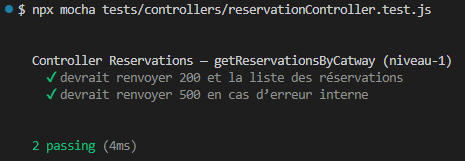
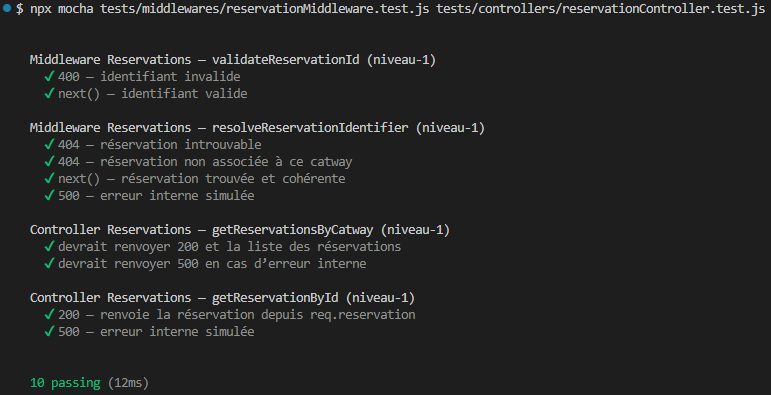
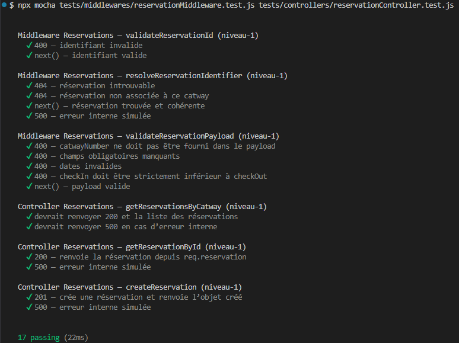

# Tests Reservations de niveau‑1 : Tests unitaires

Les tests unitaires valident la logique métier du contrôleur Reservations de manière isolée.  
Ils ne dépendent d’aucune base de données ni d’aucun service externe.

---

## 1. Objectifs

- Vérifier le comportement métier de `reservationController`
- Tester les branches conditionnelles
- Garantir la robustesse des contrôleurs avant l’intégration
- Empêcher les régressions lors des évolutions (issues 33 → 36)

---

## 2. Outils

- **Mocha** : moteur de tests  
- **Chai** : assertions  
- **Sinon** : stubs, spies, mocks

---

## 3. Principes

- Le modèle Mongoose `Catway` est entièrement stubé via `catway.mock.js`
- Les tests utilisent les helpers centralisés dans `tests.mock.js` :
  - `mockResponse()` : simule `res.status().json()`
  - `afterEachRestore()` : restaure automatiquement les stubs Sinon
- Aucun accès à MongoDB
- Chaque test est isolé

---

## 4. Scénarios testés

### 4.1 `getReservationsByCatway()` (issue‑33)

- 200 + liste des réservations si `Reservation.find()` réussit  
- 500 si `Reservation.find()` lance une erreur

---

### 4.2 `getReservationById()` (issue-34)

#### 4.2.1 Cas testés

- 200 : renvoie la réservation
- 500 : erreur interne simulée via getter

#### 4.2.2 Note technique

Le getter permet de déclencher une erreur interne **sans re‑stubber** les méthodes Express déjà stubées par `mockResponse()`.

---

### 4.3 `createReservation()` (issue-35)

#### 4.3.1 Cas testés

- **201** : création réussie  
- **500** : erreur interne simulée  

#### 4.3.2 Notes

- Le contrôleur ne valide rien : tout est géré par les middlewares.  
- `catwayNumber` est injecté automatiquement depuis `req.catway`.

---

## 5. Fichiers associés

- Tests : `tests/controllers/reservationController.test.js`
- Mocks : `tests/mocks/reservation.mock.js`
- Contrôleur : `src/controllers/reservationController.js`

---

## 6. Résultats

### 6.1 issue-33 : liste des Reservations d'un Catway

**Résultats des tests (issue-33) :**

### 6.2 issue-34 : détail d'une Reservation d'un Catway

**Résultats des tests (issue-34) et non régression :**

### 6.3 issue-35 : création d'une Reservation d'un Catway

**Résultats des tests (issue-35) et non régression :**

