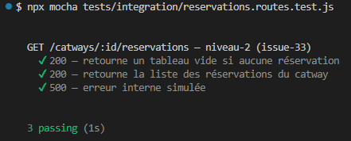
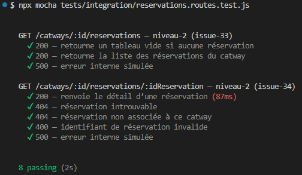
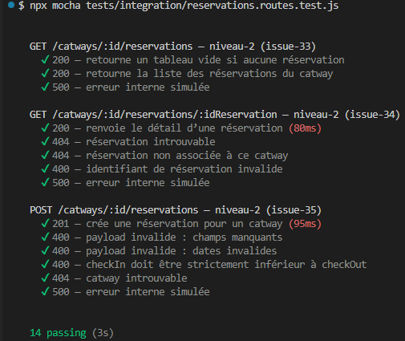
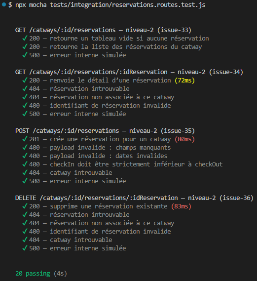

# Tests Reservations de niveau‑2 : Tests d’intégration

Les tests d’intégration valident le fonctionnement réel des routes Reservations, en interaction avec Express, Mongoose et MongoDB.

---

## 1. Objectifs

- Vérifier le comportement réel de la route `GET /catways/:id/...`
- Tester l’intégration Express + Mongoose
- Détecter les erreurs de câblage ou de configuration
- Garantir la cohérence entre contrôleur, modèle et route

---

## 2. Outils

- **Supertest** : requêtes HTTP simulées  
- **MongoMemoryServer** : base MongoDB en mémoire  
- **Mocha / Chai** : assertions

---

## 3. Principes

- Le serveur Express (`src/app.js`) est utilisé tel quel
- Une base MongoDB temporaire est créée en mémoire
- Le modèle `Reservation` est réellement utilisé
- Aucun mock → vrai test d’intégration
- Nettoyage de la base avant chaque test

---

## 4. Scénarios testés

### 4.1 `GET /catways/:id/reservation` (issue‑33)

- 200 — tableau vide si aucune réservation  
- 200 — liste des réservations si des documents existent  
- Vérification des champs (boatName, clientName, checkIn, checkOut, catwayNumber)

---

### 4.2 `GET /catways/:id/reservations/:idReservation` (issue-34)

#### 4.2.1 Cas testés

- 200 : réservation trouvée
- 404 : réservation introuvable
- 404 : réservation non associée au catway
- 400 : idReservation invalide
- 500 : erreur interne simulée

#### 4.2.2 Notes

- Dates fixes utilisées pour garantir la stabilité des tests.
- Simulation d’erreur interne via stub de `Reservation.findById`.

---

### 4.3 `POST /catways/:id/reservations` (issue-35)

#### 4.3.1 Cas testés

| Cas                    | Statut |
|------------------------|--------|
| Création réussie       | 201    |
| Champs manquants       | 400    |
| Dates invalides        | 400    |
| checkIn >= checkOut    | 400    |
| Catway introuvable     | 404    |
| Erreur interne simulée | 500    |

#### 4.3.2 Notes

- Pipeline complet testé avec MongoMemoryServer.  
- Dates déterministes utilisées pour garantir la stabilité.  
- Vérification que `catwayNumber` est correctement injecté.

---

### 4.4 `DELETE /catways/:id/reservations/:idReservation` (issue-36)

#### 4.4.1 Cas testés

| Cas                                | Statut |
|------------------------------------|--------|
| Suppression réussie                | 200    |
| Réservation introuvable            | 404    |
| Réservation non associée au catway | 404    |
| idReservation invalide             | 400    |
| Catway introuvable                 | 404    |
| Erreur interne simulée             | 500    |

#### 4.4.2 Notes

- Pipeline complet testé avec MongoMemoryServer.  
- Vérification que la réservation n’existe plus après suppression.  
- Simulation d’erreur interne via stub de `findByIdAndDelete`.

---

## 5. Fichiers associés

- Tests : `tests/integration/reservations.routes.test.js`
- Modèle : `src/models/reservation.js`
- Routes : `src/routes/reservationRoutes.js`

---

## 6. Résultats

### 6.1 issue-33 : route de la liste des reservations d'un catway

**Résultats des tests (issue-33) :**

### 6.2 issue-34 : route du détail d'une reservation d'un catway

**Résultats des tests (issue-34) et non régression :**

### 6.3 issue-35 : route de création d'une reservation d'un catway

**Résultats des tests (issue-35) et non régression :**

### 6.4 issue-36 : route de suppression d'une reservation d'un catway

**Résultats des tests (issue-36) et non régression :**

