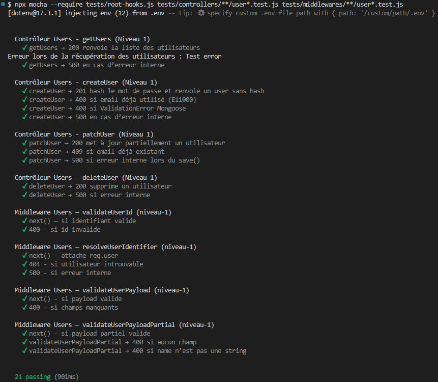

# Tests Users de niveau‑1 : Tests unitaires

Les tests unitaires valident la logique métier du contrôleur Users de manière isolée.  
Ils ne dépendent d’aucune base de données ni d’aucun service externe.

---

## 1. Objectifs

- Vérifier le comportement métier de `usersController`
- Tester les branches conditionnelles
- Garantir la robustesse des contrôleurs avant l’intégration

---

## 2. Outils

- **Mocha** : moteur de tests  
- **Chai** : assertions  
- **Sinon** : stubs, spies, mocks

---

## 3. Principes

- Le modèle Mongoose `User` est entièrement stubé via `user.mock.js`
- Les tests utilisent les helpers centralisés dans `tests.mock.js` :
  - `mockResponse()` : simule `res.status().json()`
  - `afterEachRestore()` : restaure automatiquement les stubs Sinon
- Aucun accès à MongoDB
- Chaque test est isolé

---

## 4. Scénarios testés

### 4.1 `createUser()`

#### 4.1.1 Scénarios testés

- **201** si l’utilisateur est créé (stub `User.create`)
- **400** si l’email existe déjà (`E11000`)
- **400** si un champ requis est manquant
- **500** si `User.create()` lance une erreur

#### 4.1.2 Notes

- Le contrôleur ne valide pas les données (délégué au middleware dans les phases ultérieures)
- Les stubs permettent d’isoler totalement la logique métier

---

### 4.2 `getUsers()`

#### 4.2.1 Scénarios testés

- **200** + tableau vide si aucun utilisateur
- **200** + tableau rempli si des utilisateurs existent
- **500** si `User.find()` lance une erreur

---

### 4.3 `patchUser()`

#### 4.4.1 Scénarios testés

- **200** si la mise à jour réussit
- **404** si l’utilisateur n’existe pas
- **500** si `User.save()` lance une erreur interne

#### 4.4.2 Notes

- Le contrôleur applique directement les modifications
- Les validations métier sont testées en niveau‑2

---

### 4.5 `deleteUser()`

#### 4.5.1 Scénarios testés

- **200** si la suppression réussit
- **404** si l’utilisateur n’existe pas
- **500** si `User.deleteOne()` lance une erreur interne

#### 4.5.2 Notes

- Le contrôleur ne valide rien : les middlewares garantissent l’existence de l’utilisateur en niveau‑2

---

## 5. Fichiers associés

- Tests : `tests/controllers/usersController.test.js`
- Mocks : `tests/mocks/user.mock.js`
- Contrôleur : `src/controllers/usersController.js`

---

## 6. Résultats

### 6.1 issue‑37 : Tests du CRUD Utilisateurs

---
