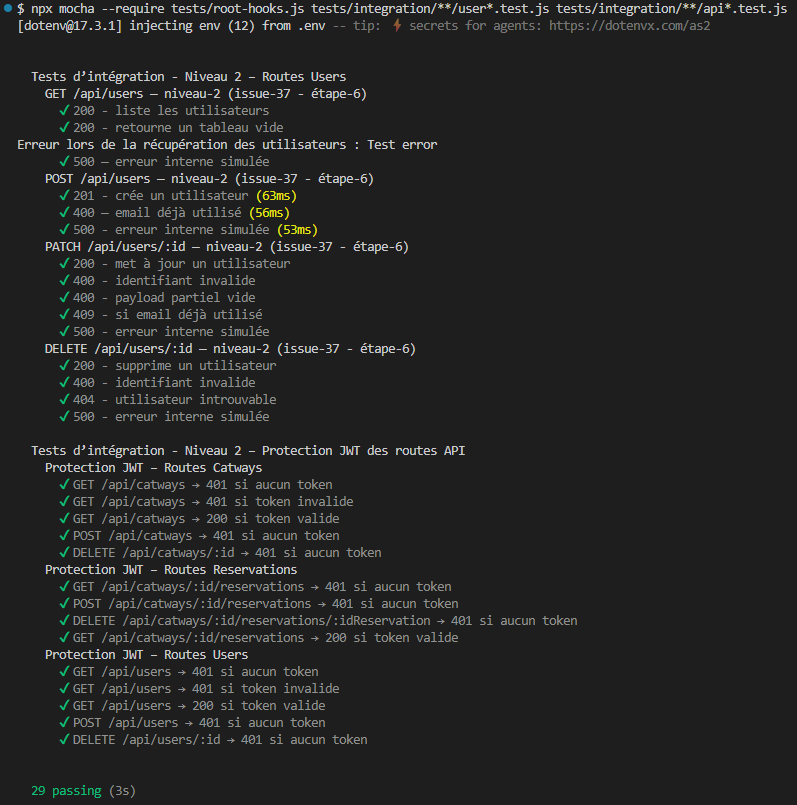

# Tests Users de niveau‑2 : Tests d’intégration

Les tests d’intégration valident le fonctionnement réel des routes Users, en interaction avec Express, Mongoose et MongoDB.

---

## 1. Objectifs

- Vérifier le comportement réel des routes `/api/users`
- Tester l’intégration Express + Mongoose
- Détecter les erreurs de câblage ou de configuration
- Garantir la cohérence entre contrôleur, modèle et route

---

## 2. Outils

- **Supertest** : requêtes HTTP simulées  
- **MongoMemoryServer** : base MongoDB en mémoire  
- **Mocha / Chai** : assertions

---

## 3. Principes

- Le serveur Express (`src/app.js`) est utilisé tel quel
- Une base MongoDB temporaire est créée en mémoire
- Le modèle `User` est réellement utilisé
- Aucun mock → vrai test d’intégration
- Nettoyage de la base avant chaque test
- Protection JWT testée via root‑hooks

---

## 4. Scénarios testés

### 4.1 `POST /users`

#### 4.1.1 Scénarios testés

- **201** si l’utilisateur est créé
- **400** si l’email existe déjà
- **400** si le payload est invalide

#### 4.1.2 Notes

- Le modèle User est utilisé tel quel
- Les erreurs MongoDB (`E11000`) sont reproduites en conditions réelles

---

### 4.2 `GET /users`

#### 4.2.1 Scénarios testés

- **200** + tableau vide si aucun utilisateur
- **200** + tableau rempli si des utilisateurs existent

---

### 4.3 `PATCH /users/:id`

#### 4.3.1 Scénarios testés

- **200** si la mise à jour réussit
- **404** si l’utilisateur n’existe pas
- **400** si le payload est invalide

#### 4.3.2 Notes

- Le pipeline complet est validé :
  `validateUserId → resolveUser → updateUser`

---

### 4.4 `DELETE /users/:id`

#### 4.4.1 Scénarios testés

- **200** si la suppression réussit
- **404** si l’utilisateur n’existe pas

#### 4.4.2 Notes

- Le contrôleur ne valide rien : les middlewares garantissent l’existence de l’utilisateur

---

### 4.5 Privatisation `/api/users` (issue‑37)

Les tests de protection JWT sont centralisés dans :

```txt
tests/integration/api.routes.test.js
```

Ils valident :

- 401 sans token  
- 401 avec token invalide  
- 200 avec token valide  

Les tests métier Users restent dans :

```txt
tests/integration/users.routes.test.js
```

---

## 5. Fichiers associés

- Tests :
  - `tests/integration/api.routes.test.js`
  - `tests/integration/users.routes.test.js`
- Modèle : `src/models/user.js`
- Routes : `src/routes/userRoutes.js`

---

## 6. Résultats

### 6.1 issue‑31 : création d’un utilisateur



---
