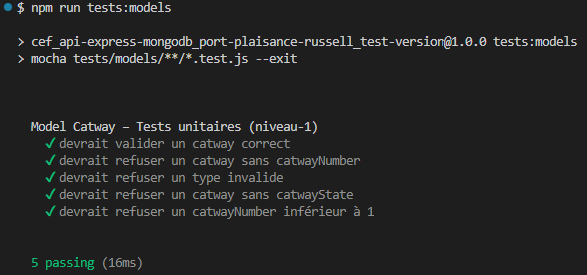

# Tests de Modélisation — Niveau 1 (Tests unitaires)

Ce document décrit les tests unitaires des modèles Mongoose du projet.  
Ces tests constituent le **niveau 1** de la stratégie globale de tests.

---

## 🎯 Objectif

Valider la **cohérence structurelle** des schémas Mongoose **sans aucune base de données**.

Les tests unitaires vérifient uniquement :

- les règles de validation (`required`, `enum`, `min`, `trim`, `lowercase`)
- la cohérence des types
- les validations structurelles spécifiques (ex : hash bcrypt pour User)
- la capacité du modèle à rejeter un document invalide
- la capacité du modèle à accepter un document valide

Aucune insertion (`save()`) n’est effectuée.  
Aucun accès à MongoDB n’est nécessaire.

---

## 🧰 Outils utilisés

- **Mocha** : moteur de tests  
- **Chai** : assertions  
- **Mongoose** : moteur interne de validation (sans connexion)  

Le moteur Mongoose est initialisé en mode permissif :

```js
mongoose.set('strictQuery', false);
```

Cela évite les warnings liés aux requêtes strictes, tout en conservant la validation interne.

---

## 🧪 Modèles testés

### 1. Modèle **Catway** (issue‑18)

Tests réalisés :

- validation d’un catway correct  
- absence de `catwayNumber`  
- `catwayNumber < 1`  
- type invalide (enum)  
- absence de `catwayState`  
- normalisation `trim` et `lowercase`

Fichier associé :  
`tests/modeles/catway.test.js`

---

### 2. Modèle **Reservation** (issue‑19)

Tests prévus :

- validation d’une réservation correcte  
- dates invalides (`checkIn > checkOut`)  
- absence de champs requis  
- cohérence du type `catwayNumber`  
- normalisation des chaînes (`trim`)  

Fichier associé :  
`tests/modeles/reservation.test.js`

---

### 3. Modèle **User** (issue‑20)

Tests prévus :

- validation d’un utilisateur correct  
- email invalide  
- absence de champs requis  
- validation structurelle du hash bcrypt  
- normalisation (`trim`, `lowercase`)  

Fichier associé :  
`tests/modeles/user.test.js`

> Note :  
> Le modèle User a déjà été testé indirectement dans les issues 15 à 17 (authentification).  
> L’issue‑20 introduit des tests unitaires dédiés au modèle.

---

## 🧩 Structure des tests

Chaque fichier de test suit la structure :

```js
describe('Model X – Tests unitaires (niveau‑1)', () => {

    before(() => {
        mongoose.set('strictQuery', false);
    });

    it('devrait valider un document correct', async () => { ... });

    it('devrait refuser un document invalide', async () => { ... });

});
```

---

## 🚫 Ce qui n’est **pas** testé au niveau 1

- insertion réelle (`save()`)
- unicité (`unique`)
- indexation
- erreurs MongoDB (`E11000`, `CastError`)
- interactions avec les contrôleurs
- interactions avec les routes

Ces éléments sont testés au **niveau 2** (intégration).

---

## 📎 Références

- Stratégie globale des tests : [docs-dev/tests-strategy.md](../../tests-strategy.md)
- Tests d’intégration des modèles : [docs-dev/tests/modeles/modeles-niveau-2-integration.md](./modeles-niveau-2-integration.md)
- Tests E2E : `docs-dev/tests/modeles/modeles-niveau-3-e2e.md` (sera ajouté lors de l'issue-22)

---

## Exemples

### Issue‑18 : tests unitaires du modèle `Catway`

**Résultats des tests (issue-18) :**



---
