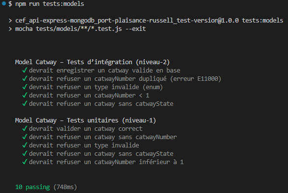
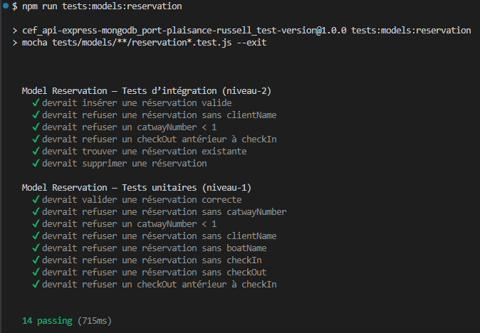

# Tests de Modélisation — Niveau 2 (Tests d’intégration)

Les tests d’intégration valident le comportement réel des modèles Mongoose en interaction avec une base MongoDB en mémoire.  
Ils constituent le **niveau 2** de la stratégie globale de tests.

---

## 1. Objectif

Tester les modèles en conditions réelles :

- connexion Mongoose réelle  
- base MongoDB isolée (MongoMemoryServer)  
- insertion (`save()`), recherche (`find()`), suppression (`delete()`)  
- gestion des erreurs MongoDB (`E11000`, `CastError`)  
- vérification des timestamps  
- validation complète du schéma en situation réelle  

Ces tests garantissent que les modèles sont prêts à être utilisés dans les routes Express (niveau‑2 fonctionnel).

---

## 2. Outils utilisés

- **Mocha** : moteur de tests  
- **Chai** : assertions  
- **Mongoose** : ODM  
- **MongoMemoryServer** : base MongoDB en mémoire, jetable et isolée  

---

## 3. Modèles testés

### 3.1 Modèle testé : Catway (issue‑18)

#### 3.1.1 Tests réalisés

- insertion valide (`save()`)  
- unicité (`unique`) → erreur MongoDB `E11000`  
- type invalide (`enum`)  
- `catwayNumber < 1`  
- champ requis manquant (`catwayState`)  
- vérification des timestamps (`createdAt`, `updatedAt`)  

#### 3.1.2 Fichier associé

`tests/modeles/catway.integration.test.js`

---

#### 3.1.3 Scénarios testés

##### 3.1.3.1 ✔ Insertion valide

- un catway complet est inséré  
- un `_id` est généré  
- les timestamps sont présents  

##### 3.1.3.2 ✔ Unicité (`unique`)

- insertion d’un premier catway `catwayNumber = 1`  
- tentative d’insertion d’un second catway avec le même numéro  
- MongoDB renvoie `error.code = 11000`  

##### 3.1.3.3 ✔ Enum invalide

- `type = "medium"` → rejeté  

##### 3.1.3.4 ✔ Min invalide

- `catwayNumber = 0` → rejeté  

##### 3.1.3.5 ✔ Champ requis manquant

- absence de `catwayState` → rejeté  

---

#### 3.1.4 🚫 Ce qui n’est **pas** testé au niveau 2

- logique métier (contrôleurs)  
- routes Express (tests d’intégration fonctionnels)  
- scénarios complets (tests E2E)  

Ces éléments sont testés dans les niveaux supérieurs.

---

#### 3.1.5 📸 Résultats (issue‑18)

Les tests passent avec succès et confirment le bon fonctionnement du modèle Catway en base MongoDB.

---

### 3.2 TModèle testé : Reservation (issue‑19)

Les tests d’intégration du modèle Reservation valident le comportement réel du schéma avec une base MongoDB en mémoire (MongoMemoryServer).

#### 3.2.1 Objectifs

- vérifier l’insertion réelle (`save()` / `create()`)
- vérifier les validations Mongoose en conditions réelles
- vérifier la cohérence des dates (`checkOut > checkIn`)
- vérifier les types (`Number`, `String`, `Date`)
- vérifier la suppression (`findByIdAndDelete`)
- vérifier la présence des timestamps (`createdAt`, `updatedAt`)

#### 3.2.2 Scénarios testés

- ✔ insertion valide  
- ✔ absence de champs requis  
- ✔ `catwayNumber < 1`  
- ✔ `checkOut < checkIn`  
- ✔ recherche (`findOne`)  
- ✔ suppression (`findByIdAndDelete`)  

#### 3.2.3 Fichier associé

`tests/modeles/reservation.integration.test.js`

#### 3.2.4 Résultats

Les tests passent avec succès et confirment le bon fonctionnement du modèle Reservation en base MongoDB.

---

## 4.📎 Références

- Stratégie globale des tests : [docs-dev/tests-strategy.md](../../tests-strategy.md)  
- Tests unitaires des modèles : [docs-dev/tests/modeles/modeles-niveau-1-unitaires.md](./modeles-niveau-1-unitaires.md)  
- Tests E2E : `docs-dev/tests/modeles/modeles-niveau-3-e2e.md` (sera ajouté lors de l'issue-22)

---
